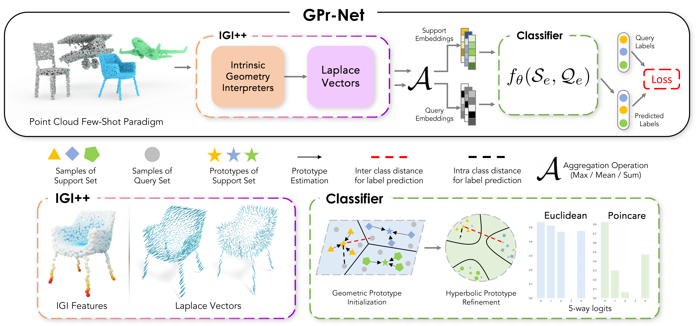

# GPr-Net: Geometric Prototypical Network for Point Cloud Few-Shot Learning @ DLGC 2023 (CVPRW)

### Tejas Anvekar, [Dena Bazazian](https://denabazazian.github.io/)

<div align="left">
<a></a>
<a></a>
<a></a>
</div>

<br><br>

<div align="center"> 

[](https://paperswithcode.com/sota/few-shot-3d-point-cloud-classification-on-3?p=gpr-net-geometric-prototypical-network-for) [](https://paperswithcode.com/sota/few-shot-3d-point-cloud-classification-on-4?p=gpr-net-geometric-prototypical-network-for) [](https://paperswithcode.com/sota/few-shot-3d-point-cloud-classification-on-1?p=gpr-net-geometric-prototypical-network-for) [](https://paperswithcode.com/sota/few-shot-3d-point-cloud-classification-on-2?p=gpr-net-geometric-prototypical-network-for)

<!-- <a href="https://pytorch.org/get-started/locally/"></a> -->



We present an overview of the proposed GPr-Net framework, which processes point clouds in a few-shot episodic paradigm using the proposed IGI and Laplace vectors to generate geometric feature sets. These features are then mapped to a higher dimensional permutation invariant feature using the symmetric operation $\mathcal{A}$ and a single Multilayer Perceptron (MLP) $f_{\theta}$. The Prototypical network $f_{\theta}$, utilizes the support and query geometric embeddings $\vec{L}(\Psi(x_s))$ = $\mathcal{S}_e$ and $\vec{L}(\Psi(x_q))$ = $\mathcal{Q}_e$ to predict few-shot labels. To overcome the distribution drift challenge in Prototypical Networks, we employ the Hyperbolic Distance of Euclidean.


</div>
<br><br>

<!-- [[Project Webpage](https://nekrasov.dev/mix3d)] [[arXiv](https://arxiv.org/abs/2110.02210)] [[Video](https://mix3d-demo.nekrasov.dev/)] -->


## Running the code
This repository contains the code for the analysis experiments of `Section 4.1. Few-Shot 3D object classification` from the paper
on the ModelNet40 benchmark and Table 1 (main paper) we use the original [SS-FSL](https://github.com/charusharma1991/SSL_PointClouds) benchmarking.


On ModelNet40, GPr-Net achieves best result for **512** points and poincare manifold on tasks: 

5 ways 10 shots    ACC = **83.11**  <br> 
5 ways 20 shots    ACC = **84.75**  <br>
10 ways 10 shots   ACC = **73.98**  <br>
10 ways 20 shots   ACC = **75.93**  <br>

logs and pretrained models can be found [[here]](https://github.com/TejasAnvekar/GPr-Net/tree/master/logs).


<br><br>

Performance of GPr-Net for 6 expirements with different seeds `Section 4.1. Few-Shot 3D object classification` from the paper we show our results from Table 1 (main paper):

|#Points | Ways | Shots | OA (Euc) | OA (Hyp)
|:--:|:--:|:--:|:--:|:--:|
|512|5|10|74.04 ± 02.33|**81.13 ± 01.51**
|512|5|20|74.98 ± 02.42|**82.71 ± 01.28**
|512|10|10|62.31 ± 02.01|**71.59 ± 01.16**
|512|10|20|63.33 ± 02.21|**73.78 ± 01.99**
|1024|5|10|74.37 ± 02.00|80.40 ± 00.55
|1024|5|20|75.12 ± 02.08|81.99 ± 00.91
|1024|10|10|62.14 ± 01.91|70.42 ± 01.80
|1024|10|20|63.43 ± 02.05|72.83 ± 01.78


## Installation

```bash
# step 1. clone this repo
git clone https://github.com/TejasAnvekar/GPr-Net.git
cd GPr-Net

# step 2: install libs step by step
conda create -n GPrNet python=3.8 -y
conda activate GPrNet
conda install pytorch==1.10.1 torchvision==0.11.2 cudatoolkit=11.3.1 -c pytorch -y
pip install geoopt einops h5py pandas tqdm torch-summary
```


## Useage

### Few-Shot Classification on ModelNet40
**Train and Evaluate**: The dataset will be automatically downloaded, run following commands.

By default, it will create a folder structure:
```
├── Logs
│   ├── {Manifold}
|   |   |──seed_{#}
|   |   |   |──{args}
|   |   |   |   |──checkpoints                 <-data.pt 
|   |   |   |   |──CSV                         <-train.csv, val.csv, test.csv
|   |   |   |   |──{logname}.log               <-Experiment logs

```


```bash
# please check config.py to understand keywords and add other paramemters as you wish.

# train and evaluate GPR-Net Euclidean
python main.py --manifold "Euclidean" --num_points 512 --c 0.0 --LV --gpu --seed 0 --kways 5 --TrS 10 --TS 10 --TrQ 20 --TQ 20 --TrE 4 --TE 300  --logname "Euclidean_GPr-Net.log"


# train and evalaute  GPR-Net Hyperbolic (Poincare)
python main.py --num_points 512 --c 1.0 --LV --gpu --seed 0 --kways 5 --TrS 10 --TS 10 --TrQ 20 --TQ 20 --TrE 4 --TE 300
```

## Re-Create Results 
```bash
# recreate GPR-Net Euclidean
sh euclidean_ablation.sh

# recreate GPR-Net Hyperbolic (Poincare)
sh poincare_ablation.sh
```


## Acknowledgment

Our implementation is mainly based on the following codebases. We gratefully thank the authors for their wonderful works.

[Self-Supervised Few-Shot Learning on Point Clouds](https://github.com/charusharma1991/SSL_PointClouds), and
[Hyperbolic Image Embeddings](https://github.com/leymir/hyperbolic-image-embeddings).


## BibTeX
Please cite our paper if it is helpful to your research:
```
@misc{anvekar2023gprnet,
      title={{GPr-Net: Geometric Prototypical Network for Point Cloud Few-Shot Learning}}, 
      author={Tejas Anvekar and Dena Bazazian},
      year={2023},
      eprint={2304.06007},
      archivePrefix={arXiv},
      primaryClass={cs.CV}
}
```